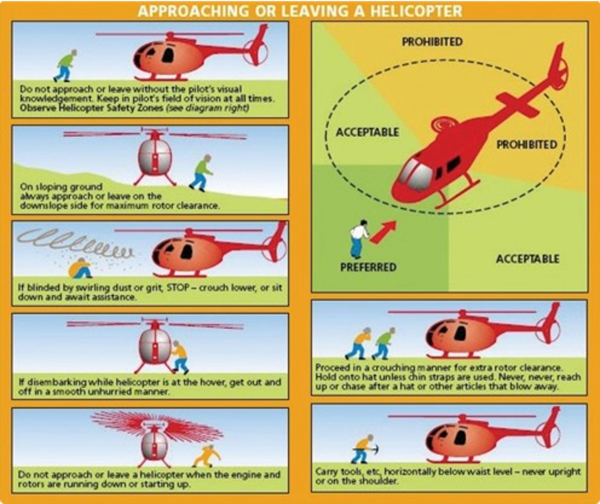
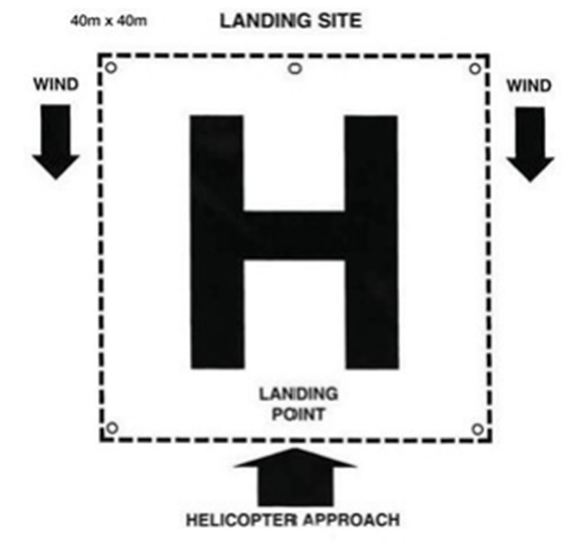
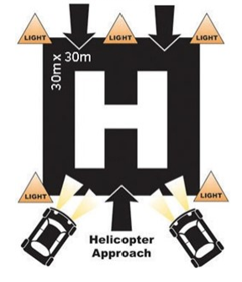

---
section_id: Vessels and Aircraft
nav_order: 17
title: 14.1 Helicopter Landing Site
layout: lesson-content
icon: compass
#topics: GitHub; Optional Software
---

## Purpose

To outline the procedure for SLS services to identify, secure, and manage a helicopter landing site.

## Overview

All SLS personnel must be aware of helicopter safety when operating near aircraft.

The pilot has final authority on whether and where a helicopter can land.

SLS personnel may assist by identifying a suitable landing site, clearing the area, controlling public access, identifying hazards, and communicating relevant information to the aircraft crew.

Personnel must not approach a helicopter unless directed by the pilot or aircraft crew.

## Procedure

### Approaching a Helicopter

Personnel must not approach a helicopter while rotors are turning unless directed by the pilot or aircraft crew.

When approaching or departing a helicopter:

- Wait for direction from the aircraft crew,
- Approach from the front or front-side where visible to the pilot,
- Never approach from the rear,
- Remain clear of the tail rotor,
- Secure loose items,
- Crouch if required due to rotor wash,
- Do not raise equipment above head height, and
- Follow crew instructions at all times.

### Establishing a Landing Site

Where SLS personnel are requested to assist with a helicopter landing site, they should:

1. Nominate a suitable lifesaver or lifeguard to manage the landing site.
2. Locate a flat area of land. As a minimum, the landing site should be 30m x 30m. Where possible, 50m x 50m is recommended.
3. Clear the area of all people and animals.
4. Remove or secure all loose objects, including umbrellas, surfboards, towels, tents, signage, and other items that may be affected by rotor wash.
5. Ensure all access points to the landing site are controlled by lifesavers or lifeguards, facing outward to monitor hazards and prevent public access.
6. Establish radio contact with the helicopter on the nominated radio channel prior to landing where required.
7. Identify and communicate hazards to the aircraft crew, including people, animals, vehicles, wires, poles, soft sand, uneven ground, loose objects, smoke, glare, or other obstructions.
8. Be aware of debris and rotor wash as the helicopter lands or takes off.
9. Remain outside the landing site unless directed by the aircraft crew.
10. Maintain landing site security until the helicopter has landed, shut down, departed, or the site is released by the aircraft crew.

The helicopter will usually land and take off into the wind.

When supporting helicopter operations over water, an IRB or RWC should generally be positioned at the 2 o’clock location of the helicopter, unless otherwise directed by the aircraft crew.

#### Day Time

#### Night Time

### SWAT Checks

The SWAT acronym may be used to assess whether a landing site is suitable.

Personnel should consider:

- **Size:** Is the area at least 30m x 30m, unless previously approved?
- **Slope:** Is the area level enough for safe landing?
- **Surface:** Is the surface firm and suitable for landing?
- **Surrounds:** Are the surroundings clear of hazards such as light poles, wires, signs, vehicles, people, animals, and structures?
- **Shape:** Is the shape of the area suitable for aircraft approach, landing, and departure?
- **Sun:** Will sun glare affect the pilot or crew?
- **Wind:** What is the wind direction? The helicopter will generally approach and depart into the wind.
- **Wires:** Are there wires or powerlines nearby? These may be difficult for the crew to see.
- **Approach:** Is the approach and departure path clear of powerlines, buildings, light poles, trees, dunes, cliffs, or other obstructions?
- **Terrain and Turbulence:** Are there buildings, structures, cliffs, dunes, or other terrain features that may cause turbulence or affect aircraft operations?

If there is any doubt about the suitability of the landing site, personnel should advise the aircraft crew by radio and identify the hazard or concern.

The aircraft crew will assess the landing site from the air before landing, and early communication of known hazards assists safe aircraft operations.

## References

- [SOP 9.4 – Requesting Helicopter Support](../9-patrol-operations-emergency/9.4-requesting-helicopter-support.md)
- [SOP 9.12 – Aircraft Crash](../9-patrol-operations-emergency/9.12-aircraft-crash.md)