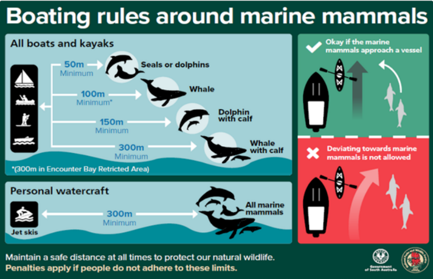

---
section: Licences
nav_order: 6
title: 4.6 Marine Mammals
layout: lesson-content
#topics: GitHub; Optional Software
---

## Purpose

To provide guidance regarding operating close to marine mammals, including whales and dolphins.

## Overview

SLSSA is committed to ensuring the safety and protection of marine mammals. All personnel are required to follow the outlined guidelines to respect and preserve these species.

Compliance with these regulations not only fulfils legal obligations but also supports the conservation of marine life.

## Procedure

Both state and federal laws protect whales and dolphins, including the distances that boats, swimmers and aircraft may approach. The relevant state legislation, administered by the Department of Environment and Water, is the _National Parks and Wildlife Act 1972_ and the _National Parks and Wildlife (Protected Animals - Marine Mammals) Regulations 2010_.

When operating a non-powered craft, including rescue boards, SLS personnel must maintain the **minimum** distance from the following marine species or groups:

- 50 metres (m) from dolphins,
- 100 m from whales,
- 150 m from a dolphin with a calf, and
- 300 m from a whale with a calf.

Powercraft, including rescue vessels, are to remain at least 300 m from all marine mammals at all times.

It is acceptable for a marine mammal to approach a vessel; however, vessels must not deliberately deviate towards marine mammals.

### Encounter Bay

Within the Encounter Bay Marine Park, all vessels and persons must keep a distance of 300 m from any marine mammal. Further information can be found at the [National Parks and Wildlife Service](https://www.marineparks.sa.gov.au/find-a-park/fleurieu-peninsula/encounter).

### Port River

Speed limits are in place for parts of the Adelaide Dolphin Sanctuary for the protection of all water users and marine life. Limits of four knots and seven knots are signed throughout the area.

### Stranded or Deceased Marine Mammals

Upon discovering a stranded or deceased marine mammal, such as a dolphin, seal or whale, within a patrolled area or nearby shoreline, SLS personnel should immediately assess the situation.

Personnel should:

- Confirm the location of the animal,
- Observe its approximate size and condition,
- Note any visible signs of injury or unusual circumstances, and
- Avoid unnecessary contact with the animal.

If the marine mammal is on the beach or in shallow water, secure the area by establishing a reasonable perimeter around the animal. Members of the public should be kept at a safe distance to prevent interference and reduce potential health and safety risks.

As soon as the area is secure, contact the State Operations Centre (SOC) to report the discovery.

SLS personnel should await instructions from the SOC or relevant authorities. This may include:

- Further securing the area or undertaking crowd control,
- Assisting with the arrival of relevant authorities, such as wildlife officers or marine specialists, and
- Providing additional information as required.

Unless directed by the SOC or onsite authorities, SLS personnel must not attempt to handle the marine mammal.

### Personal Protective Equipment

Where SLS personnel are directed to handle or are required to come into close contact with a stranded or deceased marine mammal, appropriate personal protective equipment (PPE) must be worn.

As a minimum, PPE must include:

- Gloves,
- Face mask,
- Protective eyewear, and
- Long-sleeved clothing.

PPE should be removed, cleaned or disposed of as appropriate following the interaction, and personnel should undertake appropriate hand hygiene as soon as practicable.