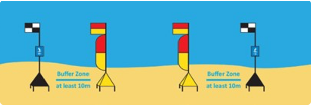
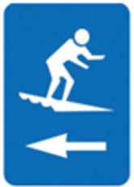
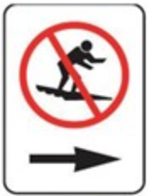
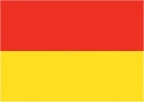
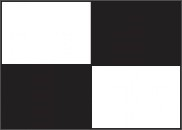
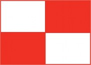

## Purpose

To standardise the use of safety flags at beaches, ensuring that Surf Life Saving services utilise internationally recognised flag systems to clearly designate patrolled swimming areas and surfcraft exclusion zones.

## Overview

Safety flags are used to designate patrolled swimming areas and other operational zones based on conditions and beach attendance. There are a standard set of safety flags which follow international standards to denote areas such as patrolled swimming area and surf craft area.

## Procedure

### Red and Yellow Patrol Flag and Feather (Augmentation)

SLS services must utilise the red and yellow patrol flag with the red and yellow feather (‘Beach Flag Augmentation’) as the standard for indicating the patrolled swimming area at beaches.

The ‘feather’ also enhances public identification of the patrolled area from the water so that the public can better ensure they continue swimming ‘between the flags’.

Patrol flags must be positioned as close as practicable to the water’s edge, taking into account tides, surf conditions, and safety.

Flags must be actively monitored and repositioned as conditions change. Flags must not be set in a fixed position for the duration of a patrol where they are too far from the water to effectively designate a patrolled swimming area.

Patrol flags must not be displayed unless a patrol or lifeguard service is actively operating.

### Black and White Quartered Flag and Feather (Surfcraft Boundary)

Where the surf conditions warrant their use, SLS services should utilise the black and white quartered flag (with optional feather) to indicate surfcraft exclusion zones. Implementation of black/white ‘feathers’ requires SLSSA approval.

### Display of Surfcraft Signage with Black and White Flags

SLS services may utilise surfcraft directional or prohibition signs in conjunction with surfcraft boundary flags. This may be through the placement of signs on the ‘flagpole’ or ‘pole base’. The most common example of this would be the use of a directional ‘surfcraft’ information sign on the flagpole. The use of the surfcraft prohibition sign must not be used unless the service has delegated authority and supporting legislation.

\
Surfcraft Directional Signage (as shown in A/NZS 2416:2010.2)

\
Surfcraft Prohibition Signage (as shown in A/NZS 2416:2010.2)

### Table 1 – Flags approved for use by SLS services in SA

| Flag                     | Name                        | Description                                                                                           |
|--------------------------|-----------------------------|-------------------------------------------------------------------------------------------------------|
|| Patrol Flag                 | Pair of flags to signify a swimming and bodyboarding zone which has a patrol on duty.                |
|| Patrol Flag – Feather       | Additional ‘feather’ flown only with rectangular patrol flag.                                         |
|| Surfcraft Boundary          | Pair of flags used to demarcate a surfboard and other water craft zone or boundary.                   |
|| Surfcraft Boundary – Feather| Additional ‘feather’ flown only with rectangular surfcraft boundary flag.                             |
|| SLS Flag                    | Single flag flown from clubhouse/tower to signify an active on duty service. Must only fly if patrolled area is open. |
|| Signal Flag                 | Pair of flags used by lifesaving services to signal other lifesavers.                                 |
|| Emergency evacuation        | Used to signal that people must leave the water due to an emergency.          |

## References

- [Public Safety and Aquatic Rescue training manual, 35th Edition](https://members.sls.com.au/members/document_library/1/media/8571)