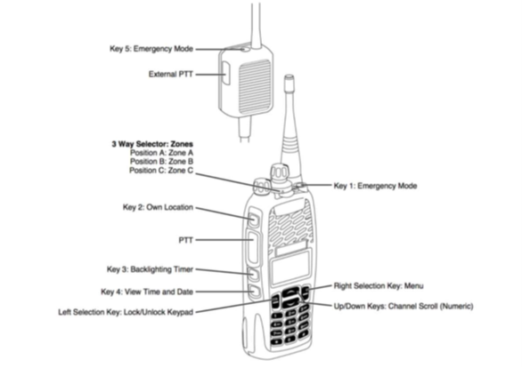
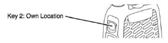
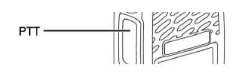

## Purpose

To outline standard features and functions available on SLSSA radios.

## Overview

SLSSA radios contain a range of standard features designed to support effective and consistent communications during lifesaving, training, and operational activities. Understanding the functionality of these features assists SLS personnel to communicate effectively, maintain situational awareness, and support operational coordination through the State Operations Centre (SOC).

This procedure outlines common radio functions and operational considerations applicable to radios operating on the SLSSA Coastal Radio Network.

## Features

### Function Keys

 
### Keypad Lock
Push to Talk (PTT), volume control and Emergency Mode are the only features that work when the radio is locked. Radio buttons and channel selection will not function when the keypad is locked. Keypad Lock Active will be displayed on the screen if a button is used before the keypad is unlocked.

Press and hold the lock/unlock keypad button to lock or unlock the keypad.

### Location

All radios on the SLSSA network operate most effectively on the beach and near the water line. If you are unable to contact another radio user, you should change location and try again.

### GPS
All radios on the SLSSA network automatically transmit their GPS location to the State Operations Centre (SOC) to provide an overview of patrolling operations and to assist the SOC in allocating resources to incidents. Radio users must continue to communicate their location to the SOC during incidents. Do not rely on GPS to provide your exact location in an emergency.

Press the Own Location button to see your GPS location. GPS locations are useful for determining the location of an object during a search.

### Transmitting
To transmit, press and hold the PTT button and wait for the tone before speaking.

Transmitting is permitted for 60 seconds. A warning will sound after 50 seconds. To continue transmitting, release the PTT button when you hear the warning then press the PTT button to continue. If you continue to transmit after the warning without releasing the PTT button, you will not be able to transmit for 30 seconds unless you turn the radio off and on before transmitting.

### Messaging
The SOC can send a text message to any radio on the SLSSA Coastal Radio Network. In most cases, the SOC will send a message to the radio allocated to the Patrol Captain. Press Options to either view or delete the message. If the message is not opened the message queue icon and information about the missed message may be shown on the display.

### Emergency Mode
The emergency mode button is to only be used in an emergency. Emergency Mode alerts may not be actively monitored outside of SOC operational hours. Your location will be automatically transmitted to the SOC and the radio will automatically transmit for 10 seconds every 30 seconds. Your alert will be acknowledged by the SOC. An emergency alert may not be acknowledged outside of regular patrolling hours.

The emergency button is an additional resource. It does not replace RESCUE, RESCUE, RESCUE or requests for assistance via existing methods.

Requests for operational assistance, including assistance from other organisations, should be made via the SOC.

Note: An Emergency Mode alert can only be received by users on the channel you are operating on. For example, an alert on Channel 3 can be acknowledged by the SOC but will not be received or acknowledged on Channel 1.

#### Accidental Activation
- Notify the SOC if you have accidentally pressed the Emergency Mode button. 
- Turn the radio off and on again to reset the Emergency Mode.

## Useful Links
- [Best Practice for Radio Users (Manufacturer Video)](http://www.youtube.com/watch?v=u_Pu0bPM1Is)
- [Radio Operating Techniques (Manufacturer Video))](http://www.youtube.com/watch?v=Ib6Aw-Jh-Wc)